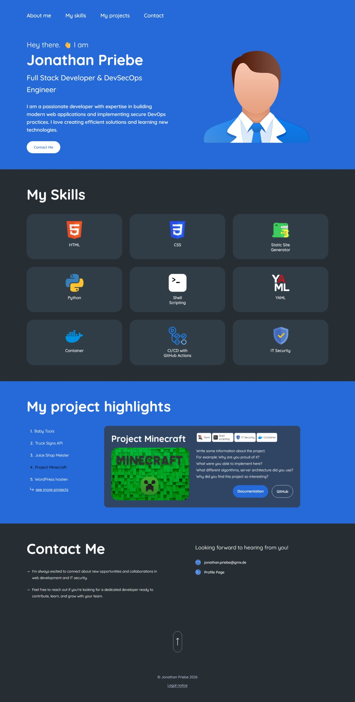

# Jonathan Priebe - Portfolio

A modern, responsive personal portfolio website built with Docusaurus, React, and TypeScript. This portfolio showcases my skills, projects, and provides multiple ways to get in touch.



## Project Handover  

📄 [Docusaurus Blog Checkliste PDF](<./Docusaurus-Blog-Checkliste.pdf>)

## About

This portfolio website demonstrates modern web development practices with a focus on:
- Clean, responsive design with mobile-first approach
- Interactive UI components with smooth animations
- Type-safe development with TypeScript
- Modular component architecture using CSS Modules
- Professional presentation of skills and projects

## Table of Contents

- [About](#about)
- [Features](#features)
- [Prerequisites](#prerequisites)
- [Quickstart](#quickstart)
- [Usage](#usage)
  - [Development Commands](#development-commands)
  - [Building for Production](#building-for-production)
- [Project Structure](#project-structure)
- [Technologies Used](#technologies-used)
- [Customization](#customization)
- [Deployment](#deployment)
  - [Deploy to GitHub Pages](#deploy-to-github-pages)
  - [Deploying using NGINX](#deploying-using-nginx)
- [Contact](#contact)

## Features

- **Custom Header Navigation**: Smooth scrolling navigation with mobile hamburger menu
- **Hero Section**: Eye-catching introduction with profile image and key highlights
- **Skills Showcase**: Interactive flip cards on desktop, horizontal scroll with grouped cards on mobile
- **Project Highlights**: Desktop list view with detail cards, vertical mobile layout
- **Contact Section**: Innovative toggle feature - click the "e" in "Contact Me" to switch between compact and expanded views
- **Responsive Footer**: Clean design with scroll-to-top functionality and legal notice link
- **Fully Responsive**: Optimized for all screen sizes with consistent 996px breakpoint
- **Dark Theme**: Professional dark color scheme (#262e34) with blue accent (#2196f3)
- **Custom Typography**: Quicksand font family for modern, clean appearance

## Prerequisites

Before you begin, ensure you have the following installed:

- **Node.js** (v18.0 or higher) - [Download here](https://nodejs.org/)
- **npm** (comes with Node.js) or **pnpm** (faster alternative)
- **Git** - For version control

To check your current versions:

```bash
node --version
npm --version
git --version
```

## Quickstart

Get started with the portfolio in three simple steps:

### 1. Clone the repository

```bash
git clone https://github.com/jonathan-priebe/my-dso-blog.git
cd my-dso-blog
```

### 2. Install dependencies

```bash
npm install
# or
pnpm install
```

### 3. Start the development server

```bash
npm start
# or
pnpm start
```

The portfolio will open automatically at `http://localhost:3000`.

## Usage

### Development Commands

| Command | Description |
|---------|-------------|
| `npm start` | Starts the development server at `http://localhost:3000` |
| `npm run build` | Builds the project for production in the `build` directory |
| `npm run serve` | Serves the production build locally for testing |
| `npm run clear` | Clears the Docusaurus cache |
| `npm run deploy` | Deploys to GitHub Pages (if configured) |

### Building for Production

To create an optimized production build:

```bash
npm run build
# or
pnpm build
```

This generates static content into the `build` directory that can be served using any static hosting service.

### Modifying Portfolio Content

The main portfolio page is located at `src/pages/index.tsx`. This file is composed of several React components that form the different sections of the portfolio.

To modify the content of a specific section, you need to edit the corresponding component in the `src/components` directory. Each component has its own folder and consists of an `index.tsx` file for the component logic and a `styles.module.css` file for the styling.

Here is a list of the components used in the portfolio:

- **Header**: `src/components/header/index.tsx`
- **Hero Section**: `src/components/hero/index.tsx`
- **My Skills**: `src/components/my-skills/index.tsx`
- **Project Highlights**: `src/components/my-project-highlights/index.tsx`
- **Contact Form**: `src/components/contact/index.tsx`
- **Footer**: `src/components/footer/index.tsx`

By editing these files, you can change the text, images, and overall appearance of the portfolio.

### Adding New Blog Posts or Documentation

- **Blog Posts**: To add a new blog post, create a new markdown file in the `blog/` directory. The file name should follow the format `YYYY-MM-DD-your-post-title.md`.
- **Documentation**: To add new documentation, create a new markdown file in the `docs/` directory and add a reference to it in `sidebars.ts`.

## Project Structure

```
my-dso-blog/
├── docs/                          # Documentation pages
├── src/
│   ├── components/                # React components
│   │   ├── contact/              # Contact section with toggle feature
│   │   │   ├── index.tsx
│   │   │   └── styles.module.css
│   │   ├── footer/               # Footer with scroll-to-top
│   │   │   ├── index.tsx
│   │   │   └── styles.module.css
│   │   ├── header/               # Navigation header
│   │   │   ├── index.tsx
│   │   │   └── styles.module.css
│   │   ├── hero/                 # Hero section
│   │   │   ├── index.tsx
│   │   │   └── styles.module.css
│   │   ├── my-project-highlights/ # Project showcase
│   │   │   ├── index.tsx
│   │   │   └── styles.module.css
│   │   └── my-skills/            # Skills section with flip cards
│   │       ├── index.tsx
│   │       └── styles.module.css
│   ├── css/
│   │   └── custom.css            # Global styles and theme
│   └── pages/
│       ├── index.tsx             # Homepage
│       └── legal/                # Legal notice pages
├── static/
│   └── img/
│       └── portfolio/            # Portfolio images and icons
├── docusaurus.config.ts          # Docusaurus configuration
├── package.json                  # Project dependencies
├── tsconfig.json                 # TypeScript configuration
└── README.md                     # This file
```

## Technologies Used

- **[Docusaurus](https://docusaurus.io/)** - Static site generator built with React
- **[React](https://react.dev/)** - UI component library
- **[TypeScript](https://www.typescriptlang.org/)** - Type-safe JavaScript
- **CSS Modules** - Scoped and modular CSS
- **[Quicksand Font](https://fonts.google.com/specimen/Quicksand)** - Modern, clean typography

### Key Technical Patterns

- **React Hooks**: `useState` for interactive components (contact toggle, project selection)
- **TypeScript Interfaces**: Type-safe props and component contracts
- **CSS Grid & Flexbox**: Responsive layouts
- **CSS Animations**: Smooth transitions and hover effects
- **Mobile-First Design**: 996px breakpoint for desktop optimization

## Customization

### Changing Colors

Edit the color scheme in `src/css/custom.css`:

```css
:root {
  --ifm-color-primary: #2196f3;        /* Primary blue */
  --portfolio-dark-bg: #1a1a1a;        /* Dark backgrounds */
  --portfolio-card-bg: #2d2d2d;        /* Card backgrounds */
}
```

### Updating Personal Information

1. **Profile Image**: Replace `static/img/portfolio/hero/profile.jpg`
2. **Contact Information**: Edit `src/components/contact/index.tsx`
3. **Projects**: Update project data in `src/components/my-project-highlights/index.tsx`
4. **Skills**: Modify skill cards in `src/components/my-skills/index.tsx`

### Adding New Sections

1. Create a new component folder: `src/components/your-section/`
2. Add `index.tsx` and `styles.module.css`
3. Import and add to `src/pages/index.tsx`

## Deployment

### Deploy to Github Pages

To deploy using SSH:

```
$ USE_SSH=true pnpm deploy
```

To deploy without using SSH, run:

```
$ GIT_USER=<Your GitHub username> pnpm deploy
```

If you are using GitHub pages for hosting, this command is a convenient way to build the website and push to the `gh-pages` branch.

### Deploying using NGINX

To deploy on an NGINX server:

1. Build the project:
   ```bash
   npm run build
   ```

2. Copy the `build` directory to your server:
   ```bash
   scp -r build/* user@server:/var/www/html/portfolio/
   ```

3. Configure NGINX:
   ```nginx
   server {
       listen 80;
       server_name your-domain.com;
       root /var/www/html/portfolio;
       index index.html;

       location / {
           try_files $uri $uri/ /index.html;
       }
   }
   ```

4. Restart NGINX:
   ```bash
   sudo systemctl restart nginx
   ```

For detailed Docker deployment, follow this [guide](./docs/guides/deploy-docusaurus-with-docker-and-nginx.md).

## Contact

**Jonathan Priebe**

- Email: [jonathan.priebe@gmx.de](mailto:jonathan.priebe@gmx.de)
- LinkedIn: [linkedin.com/in/jonathan-priebe25](https://www.linkedin.com/in/jonathan-priebe25/)
- GitHub: [github.com/jonathan-priebe](https://github.com/jonathan-priebe)

---

**Built with** ❤️ **using Docusaurus, React & TypeScript**
